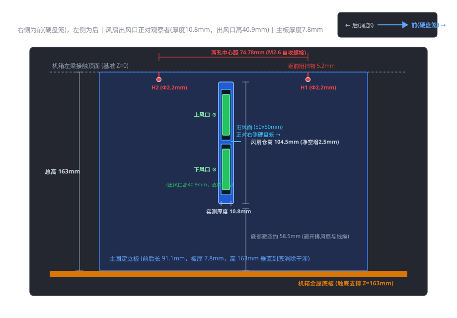

# NAS-Blower-Cooling 💨

> 专为 **TANK 米多贝克 6 盘位 NAS 机箱**（TANK 电玩）深度定制的 **双 5010 涡轮风扇直吹散热支架**。  
> 巧妙打通空闲硬盘位进风风道，配合双高静压涡轮正压直吹，彻底解决紧凑型 All-in-One 机器在狭小空间内搭载高功耗 CPU（如 Intel Core i9-9900K）的过热降频导致的性能瓶颈。

[](LICENSE)
[](https://openscad.org/)
[](#-3d-打印与装配指南)
[-brightgreen.svg)](#-实测散热效果)

---

## 📖 目录
- [项目背景与硬件规格](#-项目背景与硬件规格)
- [核心痛点与热力学挑战](#-核心痛点与热力学挑战)
- [散热改良方案与设计创新](#-散热改良方案与设计创新)
- [图解说明（问题与方案）](#️-图解说明问题与方案)
- [最新 OpenSCAD 关键尺寸与公差参数表](#-最新-openscad-关键尺寸与公差参数表)
- [3D 打印与装配指南](#-3d-打印与装配指南)
- [实测散热效果](#-实测散热效果)
- [仓库文件结构](#-仓库文件结构)
- [开源协议](#-开源协议)

---

## 🛠️ 项目背景与硬件规格

在家庭与极客服务器搭建中，很多玩家倾向于使用紧凑、美观的多盘位机箱打造“All-in-One（多合一）”宿主机。

* **机箱选型**：多年前购自淘宝“TANK 电玩”的经典 **“TANK 米多贝克 6 盘位 NAS 机箱”**。这款机箱外观质感出众，内部空间利用极为巧妙，能够在非常克制的体积内完整容纳 MATX 主板、标准多盘位热插拔硬盘笼与电源。这款机箱距首次发售已经好几年了，目前仍然在持续改进和销售中。可见其还是非常受欢迎的。
* **硬件平台**：机箱内搭载了 MATX 规格主板，CPU 则选用了从旧主力台式电脑上退役淘换下来的 **Intel Core i9-9900K（8 核心 16 线程，基准 TDP 95W，短时睿频功耗更高）**，用于承载虚拟机、各类 Docker 容器、数据存储管理与本地代码编译等高负荷任务。
* **原厂散热瓶颈**：由于紧凑型机箱内部纵向与垂直高度空间极度吃紧，机箱原生采用的是 **定制 4 热管 L 型薄型被动散热器**，且散热鳍片本身无法直接挂载常规轴流风扇。

### 🚨 矛盾的爆发点：从“忍耐”到“受不了”
这套 4 热管被动散热设计，若搭配 35W~65W 的低功耗赛扬或嵌入式 CPU，日常被动散热尚可维持。然而，对于基准 TDP 达 95W、发热密度极高的顶级桌面处理器 i9-9900K 来说，被动散热与其实际发热量之间存在巨大的悬殊差距：
1. **轻负载即高温**：根本无需全核满载，只要后台并发运行的核数稍多、主频略微爬升片刻，CPU 核心温度便如脱缰野马直奔 **95°C ~ 100°C** 撞墙。
2. **多核编译严重受限**：以往日常轻度存取尚能勉强忍受，但近期因需要高频进行全核心满载的软件编译构建任务，散热短板彻底暴露——CPU 因触碰温度墙触发严重的热降频（Thermal Throttling），时钟频率被大幅压制在基准频率之下，编译耗时成倍拉长，性能损耗极其严重。

为了彻底释放这颗 i9-9900K 应有的多核算力，并确保 NAS 硬件长期在健康温控下运行，改造机箱散热结构、打造专属的主动强迫对流风道迫在眉睫。

---

## ⚠️ 核心痛点与热力学挑战

通过对机箱内部流场与结构布局的深入拆解，我们锁定了三大热力学与空间死穴：

1. **负压抽风与致命的“旁路漏风效应”（Bypass Effect）**  
   散热器的 4 根热管穿插在数十层极高密度的微小鳍片之中，气流穿行阻抗（流动阻力）极大。机箱原配仅靠后方的一颗大尺寸排风扇向外抽风（负压构型）。流体力学遵循“阻力最小路径”，抽风气流会优先绕过散热器，从鳍片周围的宽阔缝隙大量漏走，真正穿透高阻抗鳍片通道的有效风量微乎其微。
2. **密闭侧板与“空气饥饿”死腔**  
   机箱左侧金属侧板为完全密闭结构，无进气开孔；后部除排气孔外亦无额外进风截面。整机进排风截面积严重失衡，核心区处于负压“缺气”状态，排风扇抽走的大部分只是机箱内的回流热风。
3. **空间极度受限与公差严苛**  
   散热鳍片左侧上方是金属纵梁，下方正对着机箱底部主排气风扇的外框与线束，前后两端分别被硬盘笼背板与机箱尾部限位。市面上没有任何现成的风扇架能够在不干涉内部结构的前提下安装。

---

## 💡 散热改良方案与设计创新

为了攻克高阻抗、无开孔、空间紧凑三大难题，本项目提出了 **“新风补给 + 双涡轮高静压正压直吹 + 原厂螺孔刚性锁固”** 的全套解决方案：

### 1. 巧妙利用闲置盘位（第5、6盘位）打通外部新风风道
TANK 6 盘位机箱的前面板配备 6 个热插拔盘位。实测排查发现：**第5、6硬盘位（对应散热器正前方的盘位）后方恰好无背板 PCB 与金属骨架遮挡**。  
方案将第5、6盘位保持空闲，打开前面板防尘插板，外部室温冷空气即可沿该直通腔体无阻碍涌入机箱内部，彻底根治了进气饥饿。

### 2. 双 5010 4-Pin PWM 涡轮鼓风机正压定向增压
普通轴流风扇在面对高风阻密齿鳍片时极易发生“动压反弹”与气流溃散。  
本项目选用 **两颗工业级 5010 规格的离心涡轮风机（Blower）垂直堆叠并联**：
* **进风端**：两颗风扇的正面进风口（$50 \times 50\text{ mm}$）正对前方第5、6硬盘位的冷风通道，强力抽取外部新鲜空气；
* **出风端**：侧面长方形高压出风喷口（有效出风高度 40.9mm，厚度 10.8mm）紧密贴合散热鳍片左侧迎风面；
* **定向射流**：产生高达 $20\text{ mmH}_2\text{O}$（近 $200\text{ Pa}$）的高静压正压射流，强行“射穿”4 热管狭长微通道，吸收热量后立即被散热鳍片后方的机箱主排气扇顺畅排出机外，构成了高效的“90° 直角强迫换热风道”。

### 3. T 型刚性 3D 打印支架与多轮实机装配公差收敛
基于开源参数化建模软件 **OpenSCAD** 进行全代码化设计，历经打样试装、热工压测与细节修整：
* **两端落地顶紧，杜绝共振**：支架顶端紧贴机箱左纵梁，下端直达金属机箱底板（总高 163.0mm），配合垂直三角加强筋，消除悬臂震动；
* **无损原装位固定**：利用左水平纵梁上的原厂攻丝螺孔 **H1** 与 **H2**（中心距精确为 74.78mm），垂直向下拧入紧固；
* **最新版外轮廓缩窄（解决塞入干涉）**：主立板厚度由初版的 9.8mm 缩减至 **7.8mm**，整机沿 X 轴总宽度收紧 2.0mm，使支架能顺畅滑入机箱而完全不卡外壳钣金；
* **风扇仓双向扩容（解决风扇卡死）**：挂板正面高度增至 **104.5mm**、宽度增至 **51.5mm**，顶部与右侧挡边厚度分别削减 1.0mm，使垂直和水平方向各自获得了整整 **2.5mm** 的充裕装配净空；
* **共面全贯通走线槽（解决线束断层与夹线）**：主板内侧与挂板背面的垂直/横向线槽全部对齐至基准面 $X = \text{main\_plate\_th} - 2.0 = 5.8\text{ mm}$，消除了 2mm 的阶梯台阶挡壁，线缆自风扇引出后经由 $12 \times 7\text{ mm}$ 穿孔平直埋入凹槽引向机箱尾部；底部三角筋保持完全实心，确保力学结构稳定。

---

## 🖥️ 图解说明（问题与方案）

### 图 1：原机箱布局与散热痛点
> 展示机箱内部紧凑空间、高密度 4 热管鳍片、下部排风扇以及侧板无开孔导致的进风受阻。
```text
+-------------------------------------------------------+
| [机箱前部]                          [核心散热区]       |
| +-------------+                                       |
| | 6 盘位硬盘笼 |         [4 热管密集鳍片被动散热器]     |
| |             |             (高流动阻抗，负压抽风绕流) |
| | [槽位 C 空闲]|                                       |
| +-------------+                                       |
|                                                       |
| [左侧密闭横梁] ---> 缺少正压主动直吹风道，热量极速积聚 |
|                                                       |
| [机箱底部大排气扇] ===================================> 排风出口
+-------------------------------------------------------+
```
*(对应文件：`docs/images/01_chassis_layout_issue.png`)*

---

### 图 2：硬盘位 C 进风与双涡轮风道原理
> 外部冷空气由前面板 C 槽涌入，被两颗 5010 涡轮风扇加压吸入，转 90° 直吹穿透散热鳍片，热气被底部风扇抽走。
```text
外部冷风 ──> [前面板 C 盘位开口] ──> [双 5010 正面进风盘]
                                            │ (90° 加压射流)
                                            ▼
                               [高静压强行穿透 4 热管密集鳍片]
                                            │
                                            ▼
                               [机箱底部大排气扇强力排出废热]
```
*(对应文件：`docs/images/02_airflow_redesign.png`)*

---

### 图 3：风扇支架最新工程装配正投影视图
> 完整标注了最新定稿的关键物理参数：总高 163mm、主板厚 7.8mm、孔距 74.78mm、出风口高 40.9mm、风扇仓高 104.5mm。



*(矢量图纸位置：`docs/images/03_bracket_engineering_drawing.svg`，可直接在浏览器中无损缩放查看)*

---

## 📐 最新 OpenSCAD 关键尺寸与公差参数表

本项目所有源码均位于 `cad/nas_dual_5010_bracket.scad`。所有数据均历经游标卡尺测绘与实机 3D 打印迭代验证：

| 参数变量名 | 最新数值 (mm) | 相比初版调整 | 工程设计与装配说明 |
| :--- | :---: | :---: | :--- |
| `total_height` | **163.0** | - | 纵梁下表面到机箱底板总高，支架下端触底承重抗共振 |
| `main_plate_th` | **7.8** | **-2.0 mm** | **主固定立板厚度**：由 9.8mm 缩减至 7.8mm，彻底消除整机滑入机箱时的侧面钣金挤压干涉 |
| `hole_x_offset` | **3.9** | **-1.0 mm** | 自攻螺栓中心距主板外侧基准距离（$7.8 / 2 = 3.9\text{ mm}$），精准居中 |
| `h1_y` | **5.20** | - | 前螺栓孔 H1 中心到前方硬盘笼阻挡物端面的距离 |
| `hole_pitch` | **74.78** | - | H1 与 H2 两固定孔中心距（机箱梁上实测微调值） |
| `h2_y` | **79.98** | - | 后螺栓孔 H2 在前后 Y 方向的基准坐标（$5.20 + 74.78\text{ mm}$） |
| `main_plate_len`| **91.08** | - | 主板沿前后方向总长，H2 孔后边缘保留严格 10.0mm 肉厚，避让尾部空间 |
| `hole_dia` | **2.2** | **-1.0 mm** | **螺栓孔径**：由 3.2mm 收窄至 2.2mm，专为 M2.6 自攻螺丝定制（机箱梁原孔实测 2.71/2.74mm） |
| `screw_depth` | **15.0** | - | 垂直向下盲孔深度，既保证自攻螺丝紧固咬合力，又无需费力打穿 163mm |
| `fan_holder_h` | **104.5** | **+1.5 mm** | **风扇仓外框总高**：由 103.0mm 增至 104.5mm，配合顶板减薄，双扇垂直装配净空增加 2.5mm |
| `fan_holder_w` | **51.5** | **+1.5 mm** | **风扇仓横向总宽**：由 50.0mm 增至 51.5mm，配合右壁减薄，水平卡槽净空增加 2.5mm |
| 顶面板厚度 | **2.0** | **-1.0 mm** | 顶部限位压板由 3.0mm 减薄至 2.0mm，释放内部垂直高度 |
| 右侧限位立壁厚度| **1.5** | **-1.0 mm** | 右侧外卡挡边由 2.5mm 减薄至 1.5mm，释放内部水平宽度 |
| `fan_w` / `fan_h` | **50.0 / 50.1** | 实测校准 | 单个 5010 风扇实测外轮廓（双风扇垂直堆叠实测总高 100.18mm） |
| `fan_th` | **10.8** | 实测校准 | 风扇机身实测厚度（实测 10.80mm，区别于标称 10.0mm） |
| `fan_outlet_h` | **40.9** | 实测校准 | 单颗风扇出风口开槽高度（实测出风截面，大幅超越初版 32mm 估算值） |
| `fan_outlet_top_gap`| **1.7** | 实测校准 | 风扇出风口上边缘距离风扇顶面机壳外沿厚度 |
| `fan_front_y` | **32.0** | - | 风扇进风面 Y 轴位置，确保侧向高压喷流正对散热鳍片核心区域 |
| `fan_z_bottom` | **104.5** | - | 风扇仓底部位置，下方预留约 **58.5mm** 避让机箱底部排气扇 |
| `plug_hole_w/h` | **12.0 × 7.0** | - | 4-Pin 镀金插头过孔尺寸，贴紧主板根部（$X = \text{main\_plate\_th} - 0.5$） |
| `groove_depth` | **2.0** | - | 全局导线槽深度（匹配 2.02mm 扁平排线），**背面线槽向主板内部深切 2.0mm 与正面槽共面** |
| `groove_width` | **4.0** | - | 全局导线槽宽度，支持 4-Pin 排线平整嵌入 |
| `side_groove_len`| **13.0** | - | 主板内侧贴靠导线槽长度，引线自风扇侧边无缝转入穿线孔 |

---

## 🖨️ 3D 打印与装配指南

### 1. 打印材料与切片工艺
* **推荐耗材**：强烈建议选用 **PETG** 或 **ABS**（本项目实测采用 ABS）。机箱内部空间密闭且紧邻 95W 散热鳍片，长时间运行环境温度可达 50°C~60°C 以上，PLA 极易发生热蠕变与软化变形。
* **摆放朝向**：**务必将主固定立板外侧大平面（即 $X=0$ 平面）作为贴床底面平卧打印**。平卧摆放可将支撑材料需求降到最低，并使打印层纹顺应垂直受力与悬臂方向，杜绝层间断裂。
* **壁厚与外圈**：建议设置 **4 层及以上外壁（Perimeters）**，以保证 M2.6 自攻螺丝攻入 2.2mm 预留孔时不胀裂。
* **填充率**：**35% ~ 45%**（推荐采用陀螺仪 Gyroid 填充，吸收风机高频震动效果最佳）。

### 2. 配件与工具清单
1. **5010 12V 4-Pin PWM 涡轮鼓风机** × 2（推荐双滚珠轴承、标称风压 $\ge 15\text{ mmH}_2\text{O}$ 的高压版本）我采用的台达的风扇。
2. **固定螺丝**：M2.6 自攻螺丝（长度 10mm ~ 14mm）× 2
3. **减震缓冲**：0.5mm 厚微孔单面背胶泡棉或薄款特氟龙/电工绝缘胶布（贴附于风扇仓内侧接触面，消除硬碰硬共振啸叫）
4. **风扇一分二 PWM 延长线** × 1（连接主板 CPU_FAN 接口）
5. *(可选)* 硬盘笼第5、6盘位前端磁吸防尘滤网 × 1

### 3. 一体化走线与装配步骤
1. **预攻螺纹**：打印件取下后，先使用 M2.6 螺丝垂直拧入顶部的 H1 和 H2 盲孔（深度 15mm），预先攻出微型螺牙，然后退出螺丝备用。
2. **理线与穿孔**：
   * 将两颗 5010 风扇线缆理平；
   * 将 4-Pin 插头分别穿过风扇挂板上的穿线孔（$12 \times 7\text{ mm}$）；
   * 线缆卡入主板内侧的 13mm 槽，顺着穿孔自然过渡到挂板背面；
   * 由于最新版已削平阶梯断层，线缆可平整压入背面的共面横向槽与垂直主槽，一路引至挂板底部向机箱后方出线。
3. **风扇嵌入**：风扇进风面朝前、出风口朝右，顺畅按入风扇仓。由于高宽已扩容 2.5mm，配合减震泡棉可实现稳固的“微阻尼弹性贴合”。
4. **支架装入机箱**：将整装好的支架整体垂直滑入机箱左侧金属梁下方，下端稳稳立于机箱底板，上表面贴齐梁底面。得益于 7.8mm 缩窄设计，支架能够无阻力顺滑推入到位。
5. **螺丝锁固**：从机箱横梁上方，透过原厂 2.7mm 孔位，拧入两颗 M2.6 自攻螺丝紧固。
6. **接线测试**：插好 PWM 一分二连接线，开机并在 BIOS 中设置风扇曲线，观察出风口直吹鳍片状况。

---

## 📊 实测散热效果

在完成改装并使用 AIDA64 FPU 压力测试及多核心软件编译高压环境下进行了实测对比：

* **改造前（4 热管被动散热 + 底部单排风扇）**：
  * CPU 轻载待机即在 50°C~60°C 徘徊；
  * 一旦启动多核并发或开启多线程软件编译，**温度在 10~20 秒内瞬间冲上 95°C~100°C 撞墙**；
  * 触发重度过热降频（Thermal Throttling），全核频率被强行腰斩，编译进程大幅卡顿降速。
* **改造后（双 5010 涡轮正压直吹 + C 盘位冷风新风补给）**：
  * **极限压力测试下，i9-9900K 核心温度多数时间稳定控制在 90°C 以内**；
  * 在 CPU 全核满载软件编译过程中，频率保持全程坚挺不降频，编译时间缩短为原来的数分之一；
  * 闲时低转速（30% PWM，约 2200 RPM）静音无感，高负载下强劲风压直接穿透 4 热管密集鳍片，散热效能获得质的飞跃！

---

## 📁 仓库文件结构

```text
.
├── README.md                           # 项目说明文档（本文件）
├── LICENSE                             # 开源协议 (MIT)
├── cad/
│   └── nas_dual_5010_bracket.scad      # 最新定稿版 OpenSCAD 参数化源码
└── docs/
    └── images/
        ├── 01_chassis_layout_issue.png          # 原机箱空间与散热痛点示意图
        ├── 02_airflow_redesign.png              # 硬盘位 C 进风与双涡轮风道原理图
        └── 03_bracket_engineering_drawing.svg   # 终版支架尺寸正投影工程三视图
```

---

## 📄 开源协议

本项目基于 [MIT 许可证](LICENSE) 开源。欢迎所有紧凑型 NAS 玩家、All-in-One 爱好者自由下载、切片打印与改进适配！
